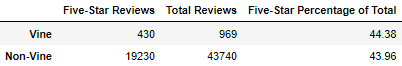

# Amazon_Vine_Analysis

## Overview

In this challenge, we assisted Jennifer at SellBy in analyzing a set of reviews of Amazon office products.  In the first half of the challenge, we used PySpark on Google Colab to extract data from an S3 bucket and transform it into several different dataframes.  We then loaded them into a Postgres database linked to an Amazon RDS instance.  In the second part of the challenge, we exported a table from the Postgres database and read it into a Pandas dataframe for analysis.

## Results

- There were 969 Vine reviews and 43,740 non-Vine reviews.
- There were 430 five-star Vine revies and 19,230 five-star non-Vine reviews.
- 44.38% of Vine reviews and 43.96% of non-Vine reviews were five stars.

## Summary

Our results have a difference in five-star percentage of around 0.42%.  This is not enough for us to state that there is a positivity bias for reviews for in the Vine program.  While the Vine percentage is techincally higher, a difference of less than half a percent in our data is very small and likely insignificant.  If we wanted to determine if the difference was statistically significant, we could apply a two-proportion z-test.
